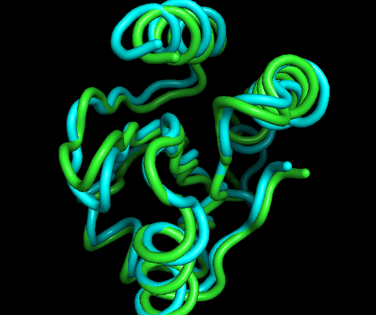

```{r setup, include=FALSE}
knitr::opts_chunk$set(echo = TRUE)
```

The sequences of genes, proteins, and entire genomes hold clues to their function. Repeated subsequences or sequences with a strong similarity to each other can be clues to things such as evolutionary conservation or functional relatedness. As such, sequence analysis for motifs and domains are core techniques in bioinformatics. Bioconductor contains many useful packages for analyzing genes, proteins, and genomes. Here, I will use Bioconductor to analyse sequences for features of functional interest, such as _de novo_ DNA motifs and known domains from widely used databases.

Outline:

* Finding DNA motifs
* Finding protein domains
* Performing multiple alignments
* Aligning genomic length sequences
* Machine learning for novel feature detection
* 3D structure protein alignment

I will also need MEME, a program for finding statistically overrepresented sequence motifs in sets of sequences. You can download the software from http://meme-suite.org/doc/download.html/, then type the following commands

>tar zxf meme-5.x.x.tar.gz
cd meme-5.x.x
./configure --prefix=$HOME/meme --with-url=http://alternate.meme-suite.org/ --enable-build-libxml2 --enable-build-libxslt
make
make test
make install
            
Edit your shell configuration file to add $HOME/meme/bin and $HOME/meme/libexec/meme-5.x.x to your shell's path. This can often be done by editing the file named .profile to add the following line:

>export PATH=$HOME/meme/bin:$HOME/meme/libexec/meme-5.x.x:$PATH

## Finding DNA motifs

Load libraries:

```{r message=FALSE, warning=FALSE}
library(universalmotif)
library(Biostrings)
```

Load a motif of interest:

```{r}
motif <- read_matrix(file.path(getwd(), "simple_motif.txt"))
```

Load sequences to scan with the motif:

```{r}
sequences <- readDNAStringSet(file.path(getwd(), "promoters.fa"))
```

Perform a scan:

```{r}
motif_hits <- scan_sequences(motif, sequences = sequences)
motif_hits
```

Calculate if the motif is enriched in the sequences:

```{r}
motif_info <- enrich_motifs(motif,
                            sequences,
                            shuffle.k = 3,
                            verbose = 0,
                            RC = TRUE)
motif_info
```

Run MEME to find novel motifs:

```{r}
meme_path = "/Users/cenkcelik/meme/bin/meme"
meme_run <- run_meme(sequences,
                     bin = meme_path,
                     output = "meme_out",
                     overwrite.dir = TRUE)
motifs <- read_meme("meme_out/meme.txt")
view_motifs(motifs)
```

## Finding protein domains

Next step is to discover the function of a protein sequence. Here, I will use _PFAM_ database that encodes protein domains as profile Hidden Markov Models and reports any likely occurrences of domains.

I will need _Annotationdbi_ database package, more specifically _org.Gs.eg.db_, _org.EcK12.eg.db_ and _org.At.tair.db_. Also, I will need _bio3d_ package.

Load the database package and inspect the types of keys in the database:

```{r}
library(org.Hs.eg.db)
keytypes(org.Hs.eg.db)
```

Now, get a vector of keys and query the database:

```{r}
k <- head(keys(org.Hs.eg.db,
               keytype = "ENSEMBL"), n = 3)

result <- select(org.Hs.eg.db,
                 keys = k,
                 keytype = "ENSEMBL",
                 columns = c("PFAM"))

result
```

Load the _PFAM_ database and extract descriptions, then get all keys from the _PFAM_ database:

```{r}
library(PFAM.db)
descriptions <- PFAMDE

all_ids <- mappedkeys(descriptions)
id_description_mapping <- as.data.frame(descriptions[all_ids])
```

Join the descriptions to _PFAM_:

```{r}
library(dplyr)
left_join(result,
          id_description_mapping,
          by = c("PFAM" = "ac"))
```
## Finding InterPro domains

InterPro -a database of predictive models- aggregates information from multiple sources to reduce redundancy in annotations and aid interpretability.

Load the libraries and check if the database has the protein data of interest:

```{r}
library(ensembldb)
library(EnsDb.Rnorvegicus.v79)
hasProteinData(EnsDb.Rnorvegicus.v79)
```

Build a list of genes to query:

```{r}
e <- EnsDb.Rnorvegicus.v79
k <- head(keys(e, keytype = "GENEID"), n = 3)
```

Pull relevant data:

```{r}
select(e,
       keys = GeneIdFilter(k),
       columns = c("TXBIOTYPE",
                   "UNIPROTID",
                   "PROTEINID",
                   "INTERPROACCESSION"))
```

For non-ENSEMBL databases, I will use _biomaRt_ package.

```{r}
library(biomaRt)
biomart_athal <- useMart(biomart = "plants_mart",
                         host = "plants.ensembl.org",
                         dataset = "athaliana_eg_gene")

getBM(c("tair_locus", "interpro"),
      filters = c("tair_locus"),
      values = c("AT5G40950", "AT2G40510"),
      biomart_athal)
```

## Performing multiple alignments of genes or proteins

I will use _ape_ and _DECIPHER_ packages to determine conserved and divergent regions of aligned sequences.

I will need _msa_, _ape_ and _seqinR_ packages.

Load the libraries and sequences:

```{r}
library(msa)
seqs <- readAAStringSet(file.path(getwd(), "hglobin.fa"))
```

Perform multiple sequence alignment:

```{r}
alignment <- msa(seqs, method = "ClustalOmega")
alignment
```

Visualise the result:

```{r}
msaPrettyPrint(alignment,
               output = "pdf",
               showNames = "left",
               showLogo = "top",
               askForOverwrite = FALSE,
               verbose = FALSE,
               file = "whole_aligned.pdf")
```

Tree visualisation:

```{r}
library(ape)
library(seqinr)
alignment_seqinr <- msaConvert(alignment,
                               type = "seqinr::alignment")
distances <- dist.alignment(alignment_seqinr,
                            "identity")
tree <- nj(distances)
plot(tree, main = "Phylogenetic Tree of HBA Sequences")
```

## Aligning genomic length sequences

For longer sequences, it is harder than aligning shorter sequences. It all starts with finding short anchor alignments and working the alignment out from there. The process usually ends up with blocks of synteny: regions that match well between the different genome alignments.

I will need _DECIPHER_ package.

Load the libraries and genome sequences:

```{r}
library(DECIPHER)
long_seqs <- readDNAStringSet(file.path(getwd(), "plastid_genomes.fa"))
long_seqs
```

Prepare the sequences in a local database:

```{r}
Seqs2DB(long_seqs,
        "XStringSet",
        "long_db",
        names(long_seqs))
```

Find the blocks of synteny:

```{r}
synteny <- FindSynteny("long_db")
pairs(synteny)
```

Plot the synteny blocks:

```{r}
plot(synteny)
```

Make an alignment:

```{r}
alignment <- AlignSynteny(synteny, "long_db")

blocks <- unlist(alignment[[1]])
writeXStringSet(blocks, "genome_blocks_out.fa")
```

## Machine learning for novel feature detection in proteins

Here, I will build a machine learning model that can classify protein of interest accurately. This model will then be used to show which parts of the proteins result in the classification.

I will need _kebabs_, _Biostrings_, _e1071_, and _readr_ libraries.

Load the libraries and input files:

```{r}
library(kebabs)
library(Biostrings)
library(readr)

seqs <- readAAStringSet(file.path(getwd(), "ecoli_proteins.fa"))
classes <- read_csv(file.path(getwd(), "ecoli_protein_classes.txt"), col_names = TRUE)
classes <- classes$class
```

Separate training and test sets:

```{r}
num_seqs <- length(seqs)
training_proportion <- 0.75
training_set_indices <- sample(1:num_seqs,
                               training_proportion * num_seqs)
test_set_indices <- c(1:num_seqs)[-training_set_indices]
```

Build the model with training dataset:

```{r}
kernel <- gappyPairKernel(k = 1, m = 3)
model <- kbsvm(x = seqs[training_set_indices],
               y = classes[training_set_indices],
               kernel = kernel,
               pkg = "e1071",
               svm = "C-svc",
               cost = 15)
```

Use the model to predict the classes of the test dataset:

```{r}
predictions <- predict(model,
                       seqs[test_set_indices])

evaluatePrediction(predictions,
                   classes[test_set_indices],
                   allLabels = c(1, -1))
```

Examine the prediction profile of a sequence, then plot prediction profile:

```{r}
seq_to_test <- seqs[[1]][1:10]
seq_to_test

prediction_profile <- getPredictionProfile(seq_to_test,
                                           kernel,
                                           featureWeights(model),
                                           modelOffset(model))

plot(prediction_profile)
```

## 3D structure protein alignment

3D models can reveal structural properties that are common or unique to proteins: these can suggest evolutionary or functional commonalities.

I will use _bio3d_ package.

Load the library and PDB structure files:

```{r}
library(bio3d)

a <- read.pdb(file.path(getwd(), "1xwc.pdb"))
b <- read.pdb(file.path(getwd(), "3trx.pdb"))
```

Align the structure:

```{r}
pdbs <- pdbaln(list("1xwc" = a,
                    "3trx" = b),
               fit = TRUE,
               exefile = "msa")
```

Launch and render the alignment in PyMOL:

```{r message=FALSE, warning=FALSE}

pymol(pdbs,
      exefile = "/usr/local/bin/pymol",
      type = "launch",
      as = "cartoon")
```

Output:



```{r session info}
sessionInfo()
```